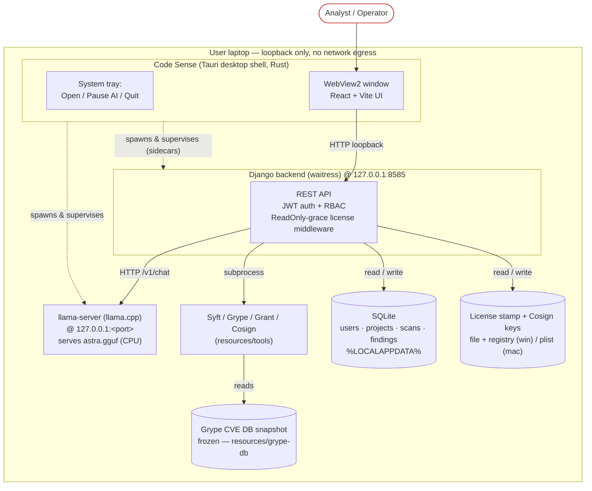
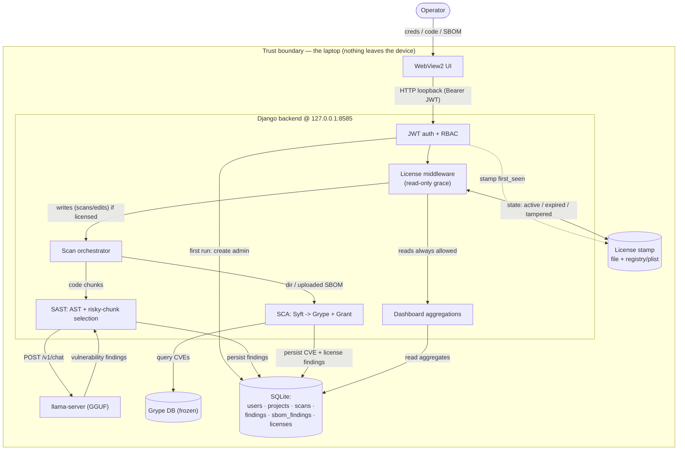
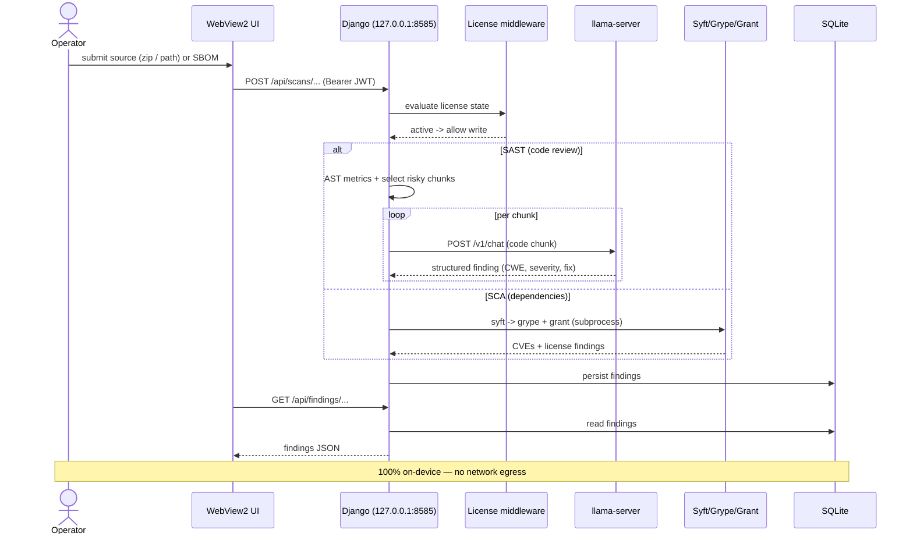
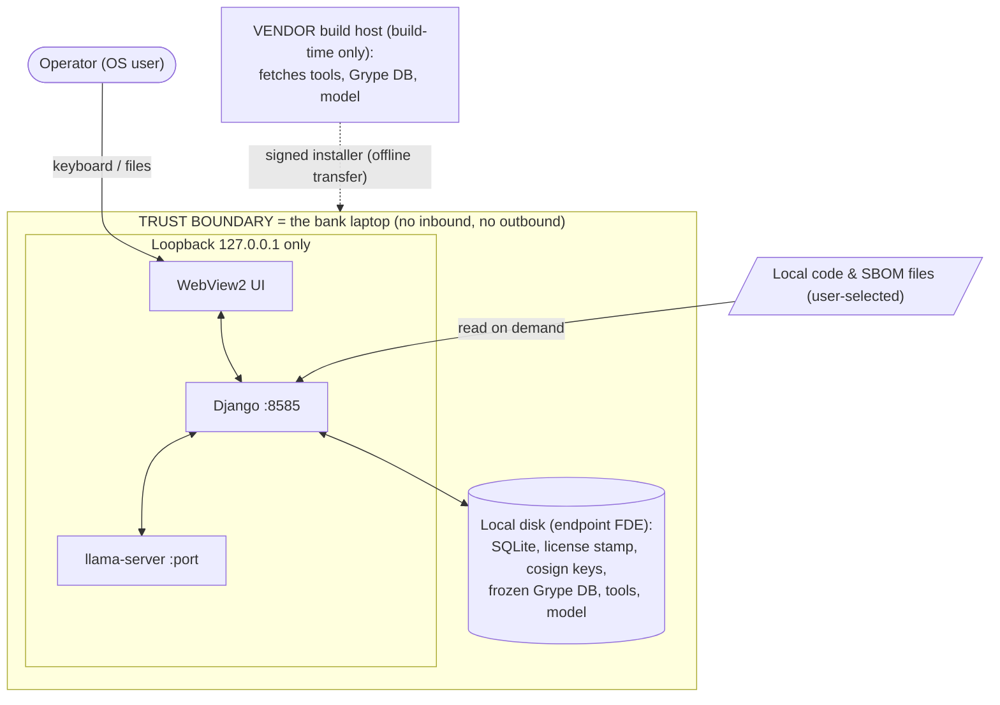

# Code Sense — Architecture & Data Flow

Offline, self-contained desktop tool. Everything below runs **on the user's laptop**;
there is **no network egress** at runtime (listeners bind to `127.0.0.1` only).

---

## 1. Architecture (component / deployment view)



### ASCII fallback

```
+--------------------- User laptop  (loopback only, no egress) ----------------------+
|                                                                                    |
|   +----------- Code Sense  (Tauri shell, Rust) -----------+                         |
|   |  tray: Open / Pause AI / Quit                         |                         |
|   |  WebView2 window  ->  React + Vite UI                 |                         |
|   +----------------------------+--------------------------+                         |
|        |  (shell spawns &       |  HTTP  http://127.0.0.1:8585                       |
|        |   supervises sidecars) v                                                   |
|   +----------------- Django backend (waitress) -----------------+                   |
|   |  REST API · JWT auth · RBAC · ReadOnly-grace license check  |                   |
|   |    |                                                        |                   |
|   |    +-- HTTP /v1/chat ---> llama-server (llama.cpp + astra.gguf, CPU)            |
|   |    +-- subprocess ------> Syft / Grype / Grant / Cosign  (resources\tools)      |
|   |    +-- reads ----------->  Grype CVE DB snapshot (frozen, resources\grype-db)   |
|   |    +-- read/write ------>  SQLite  +  license stamp  +  cosign keys             |
|   |                            (%LOCALAPPDATA%\com.codesense.desktop)               |
|   +-------------------------------------------------------------+                   |
|                                                                                    |
|   X no inbound ports beyond loopback   X no outbound traffic   X no telemetry       |
+------------------------------------------------------------------------------------+
```

| Component | Role |
|---|---|
| Tauri shell (Rust) | Native window, tray, and lifecycle/supervision of the two sidecars |
| WebView2 UI (React/Vite) | The app UI; talks only to `127.0.0.1:8585` |
| Django backend (waitress) | REST API, JWT auth, RBAC, license gating, scan orchestration |
| llama-server (llama.cpp) | Local LLM inference for the SAST code review (CPU) |
| Syft / Grype / Grant / Cosign | SBOM generation, CVE scan, license scan, SBOM signing |
| Grype DB snapshot | Frozen offline CVE database (`AUTO_UPDATE` off at runtime) |
| SQLite | All app data (users, projects, scans, findings, SBOM findings) |
| License store | Signed first-run stamp in a file + a redundant OS store (registry/plist) |

---

## 2. Data flow diagram



### ASCII fallback

```
 Operator
    |  creds / source code / SBOM
    v
 [WebView2 UI] --HTTP loopback (Bearer JWT)--> [Django backend @127.0.0.1:8585]
                                                   |
        +------------------------------------------+-----------------------------+
        |                       |                  |                             |
        v                       v                  v                             v
   [JWT auth + RBAC]     [License middleware] [Scan orchestrator]          [Dashboard]
        |                  ^   (read-only grace)   |                            |
        | create admin     |  state: active/        +--- code ---> [SAST: AST + chunks]
        v                  |  expired/tampered                         |  POST /v1/chat
   (SQLite users)          v                                           v
                      [License stamp]                          [llama-server (GGUF)]
                       file + reg/plist                                |  findings
                                                                       v
   [Scan orchestrator] --- dir / SBOM ---> [SCA: Syft -> Grype + Grant] ---> (SQLite findings)
                                                |  query CVEs
                                                v
                                        [Grype DB snapshot (frozen)]

   Dashboard / finding views ----read----> (SQLite)
   ===> No data ever leaves the laptop (no cloud, no telemetry, no license server) <===
```

---

## 3. Scan lifecycle (sequence)



---

## 4. Network / trust boundary (for security review)



### ASCII fallback

```
                         (no inbound)          (no outbound)
                              X                     X
  +=====================  TRUST BOUNDARY: the bank laptop  =====================+
  ||                                                                           ||
  ||  Operator (OS user) --keyboard / user-selected files-->  Code Sense       ||
  ||                                                                           ||
  ||  Loopback 127.0.0.1 (never bound to a routable interface):                ||
  ||     WebView2 UI <---> Django :8585 <---> llama-server :<port>             ||
  ||                                                                           ||
  ||  Local disk (relies on endpoint full-disk encryption / BitLocker):        ||
  ||     SQLite | license stamp | cosign keys | frozen Grype DB | tools+model  ||
  ||                                                                           ||
  +=============================================================================+
        ^
        |  BUILD-TIME ONLY, on the VENDOR build host (NOT the bank laptop):
        |  fetch Syft/Grype/Grant/Cosign + Grype DB + model  ->  bake into the
        |  signed installer  ->  transfer offline to the laptop
```

**What crosses the boundary:** nothing over the network. The only inputs are the operator
at the keyboard and local files they explicitly select; the only "import" is the signed
installer, transferred offline. No runtime process opens a non-loopback socket.

---

## Notes
- **Ports:** backend `127.0.0.1:8585`; `llama-server` on a private loopback port. No other listeners.
- **OS specifics:** Windows uses WebView2 + a registry second store for the license; macOS uses WKWebView + a `~/Library/Preferences` plist second store. Logic is otherwise identical.
- **At rest:** data lives in `%LOCALAPPDATA%` (Windows) / `~/Library/Application Support` (macOS); confidentiality relies on endpoint full-disk encryption.
- **License gating:** the middleware lets reads through always; write/scan endpoints are blocked once the license is expired or tampered (read-only grace).
